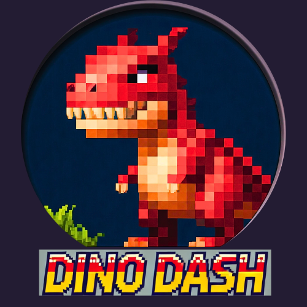

<h1 align="center">Dino Dash</h1>

  

Dino Dash is an endless platformer web game made with Godot Engine, heavily inspired by the classic Chrome offline dino game.  Dash through the desert, jump over obstacles, and see how far you can run!

## Play Now!

  

## Features

* **Endless Running:**  See how far you can get!
* **Simple Controls:** Easy to pick up and play.
* **Increasing Difficulty:**  The game gets faster and the obstacles become more challenging as you progress.
* **Retro Style:**  Enjoy the nostalgic pixel art style.
* **Web Browser Play:**  Play directly in your browser, no downloads required!

## How to Play

* Use the **Spacebar** or **Up Arrow Key** to jump.
* Avoid the cacti and other obstacles.
* The longer you run, the faster the game gets!

## Development

Dino Dash was developed using the Godot Engine.

### Building from Source (Optional)

If you want to build the game from source, you'll need to have Godot Engine installed.

1. Clone the repository: `git clone https://github.com/your-username/Dino-Dash.git`
2. Open the project in Godot Engine.
3. Export the project for your desired platform.

## Contributing

Contributions are welcome! Feel free to submit pull requests with bug fixes, new features, or improvements.  Please make sure to follow the existing code style.

## License

Dino Dash is released under the MIT License.  See the [LICENSE](LICENSE) file for details.

## Credits

* Game Design & Development: Your Name/Your GitHub Username
* Art: [Credit any artists or use "Assets created by..." if applicable]
* Sound Effects: [Credit any sound effect creators or use "Sound effects from..." if applicable]
* Music: [Credit any music composers or use "Music by..." if applicable]

## Screenshots (Optional)

  
  

## Contact

* Email: your.email@example.com
* Twitter: @your_twitter_handle (Optional)
* Discord: Your Discord Username/Server Link (Optional)
